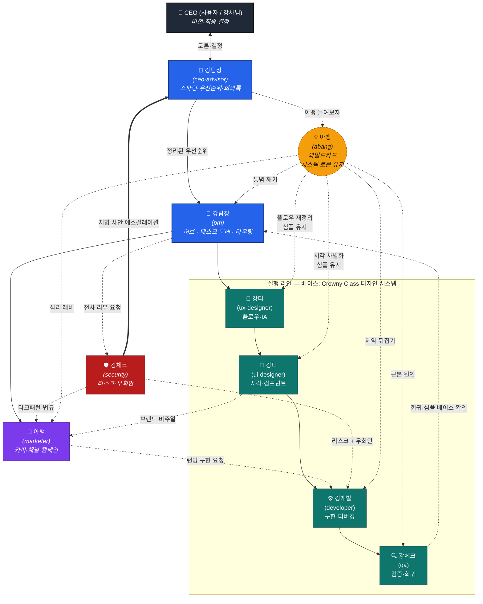
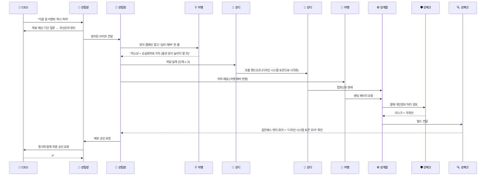

# 강팀 — 역할 아키텍처

> **2026-05 통합 안내**: 강팀은 **9인 → 5인**으로 축소됐다. 아래 다이어그램은 *원래 9인 구조*의 책임 분할을 보여주는 참고용. 현재 5인 매핑은 [`../CLAUDE.md`](../CLAUDE.md) 의 "팀 정체성" 참조 — 강사장→강팀장, 강디1·강디2→강디, 강감시→강체크, 강홍보·구아뱅→아뱅.

**강팀**(Ai_Team)의 에이전트들이 어떻게 연결되어 있는지 한 장으로 본다.

- **실선** = 정상 라인(태스크/산출물이 위→아래로 흐름)
- **점선** = 와일드카드 호출 / 검토 루프 / 에스컬레이션
- **디자인 베이스** = **"Crowny Class 디자인 시스템"** (보라→분홍 그라데이션, Pretendard, Lucide — 강디가 박는 절대 원칙, 아뱅도 토큰은 깨지 않음. 전체: [`../.claude/knowledge/ui-designer/design-system.md`](../.claude/knowledge/ui-designer/design-system.md))

---

## 이름 매핑

| 닉네임 | 역할 | 에이전트 ID |
|---|---|---|
| 👤 (사용자, 강사님) | **진짜 CEO** — 최종 결정 | — |
| 🧭 **강팀장** | CEO 보좌역 — 스파링·우선순위·회의록 | `pm` |
| 🎯 **강팀장** | 기획자(PM) — 허브·태스크 분해·라우팅 | `pm` |
| 🧪 **강디** | UX 디자이너 — 흐름·IA·퍼널 | `designer` |
| 🎨 **강디** | UI 디자이너 — 시각·컴포넌트·상태 | `designer` |
| ⚙️ **강개발** | 개발자 — 구현·디버깅 | `developer` |
| 🔍 **강체크** | QA — 사용자 관점 검증·회귀 | `qa` |
| 📣 **아뱅** | 마케팅 — 카피·채널·캠페인 | `marketer` |
| 🛡️ **강체크** | 보안책임자 — 리스크·우회안·법규 | `qa` |
| 💡 **아뱅** | 아이디어뱅크 — 와일드카드 (점선) | `marketer` |

---

## 전체 구조



---

## 레이어별 요약

### 1. 결정 레이어 (Decision)
| 닉네임 | 결정권 | 핵심 산출물 |
|---|---|---|
| **CEO (사용자)** | ✅ 최종 결정 | 비전·우선순위·승인 |
| **강팀장** | ❌ 토론만 | 회의록·우선순위 매트릭스·반대 의견 |

> 강팀장은 **결정하지 않는다**. 동의 봇이 되지 않도록 *반대 의견*을 던지는 게 본업.

### 2. 조율 레이어 (Coordination)
| 닉네임 | 입력 | 출력 |
|---|---|---|
| **강팀장** | 강팀장의 우선순위 | 태스크 분해 + 라우팅 + 의존성 |

> 강팀장은 **허브**다. 직접 만들지 않고, *누가 무엇을 언제까지*만 정한다.

### 3. 실행 라인 (Execution — 순차 의존성)

```
강디 → 강디 → 강개발 → 강체크
(UX)    (UI)    (Dev)    (QA)
```

모든 단계에서 **"Crowny Class 디자인 시스템"** 베이스를 박는다:

- **강디**: 한 화면=한 목표 / 분기 ≤ 2 / 단계 ≤ 3 (흐름 단순성은 유지)
- **강디**: 보라→분홍 그라데이션 CTA / Pretendard / radius 10·16 / shadow-md 카드 / Lucide 아이콘 / 임의 HEX 금지
- **강개발**: 디자인 시스템 CSS 변수만 사용, 동작이 우선, 추상화는 *세 번째 비슷한 케이스가 보일 때*만
- **강체크**: 사양 검증 시 *디자인 시스템 토큰이 깨지지 않았는지*도 함께

### 4. 확장 레이어 (Growth)
| 닉네임 | 위치 |
|---|---|
| **아뱅** | 강디(비주얼)·아뱅(심리 레버) 받아 카피·채널·캠페인. 랜딩 페이지 필요 시 강개발로 다시 흐름. |

### 5. 감시 레이어 (Guard)
| 닉네임 | 권한 |
|---|---|
| **강체크** | 모든 에이전트 산출물 리뷰. 치명 사안은 강팀장 경유 사용자에게 직보. *"안 됩니다"로 끝내지 않고 우회 안까지 제시.* |

### 6. 와일드카드 (Wild)
| 닉네임 | 호출 조건 / 제약 |
|---|---|
| **아뱅** | 답이 *교과서적으로 수렴*할 때 / *경쟁사와 똑같아질 때* / *같은 버그 반복*될 때. 강팀장 라인 밖에서 어떤 회의든 끼어들 수 있음. **단, "Crowny Class 디자인 시스템" 토큰은 깨지 않는다** — 차별화는 임의 색·폰트를 *늘리지 않고* 카피·타이밍·심리·기존 토큰 깊이 활용으로 푼다. |

---

## 아뱅 ↔ 강디 — 겹치지 않는 이유

| | **강디 (UX)** | **아뱅** |
|---|---|---|
| 목적 | *마찰을 줄여* 목표까지 데려가기 | *심리 레버를 일부러 심어* 행동·수익 유도 |
| 기본값 | 정석·교과서·심플 | 정석을 깨는 것 (단, 심플은 유지) |
| 산출물 | 플로우·IA·퍼널 단계 | 한 줄짜리 발상 ("희소성으로 가자") |
| 위치 | 강팀장 라인 안 | 강팀장 라인 *밖*, 점선 |

> **아뱅은 "무엇을 어떤 순서로"를 *재정의*하고, 강디은 그걸 *흐름으로 구조화*한다.** 역할이 *겹치는* 게 아니라 *연결*된다. 아뱅이 안 끼어드는 게 디폴트 — 강디이 *정석으로 굳을 때만* 호출.

---

## 트리거 매트릭스 — "언제 누구를 부르는가"

| 상황 | 1차 호출 | 보조 호출 |
|---|---|---|
| 사용자가 우선순위 흔들릴 때 | **강팀장** | — |
| 새 기능 요청 | **강팀장** → 강디 → 강디 → 강개발 → 강체크 | — |
| 카피·캠페인 필요 | **강팀장** → 아뱅 | 아뱅 (심리 레버) |
| 데이터 수집·결제·로그인 추가 | **강팀장** → 강체크 → 강개발 | — |
| 답이 *너무 정석*일 때 | **아뱅** | — |
| 테스트는 통과하는데 사용자 불만 | **강체크** | 아뱅 (근본 원인이 심리·설계일 수 있음) |
| 법·약관·다크패턴 의심 | **강체크** | 강팀장 (치명 시 사용자 직보) |
| 디자인 시스템 토큰 밖 색·폰트가 보일 때 | **강팀장**이 강디에 *반려* | — |

---

## 흐름 예시 — "이벤트 페이지 하나 만들자"



---

## 핵심 규칙 4가지

1. **결정은 위로, 산출물은 아래로.** CEO만 결정한다. 강팀장은 분해만, 강팀장은 정리만.
2. **강체크·강체크 통과 없이는 배포 없다.** 두 감시 레이어가 같은 산출물을 다른 각도로 본다(사용자 경험 vs 리스크).
3. **아뱅은 라인 밖이다.** 점선으로 매달려 있다가 *통념대로 굳을 때*만 끼어든다 — 정상 라인을 대체하지 않는다.
4. **디자인 베이스 = "Crowny Class 디자인 시스템".** 강디가 박고, 강팀장이 반려권으로 지키고, 아뱅도 *토큰은 깨지 않는다*. 차별화는 *임의 색·폰트 추가*가 아니라 *카피·타이밍·심리·기존 토큰 깊이 활용*으로 푼다. 전체 시스템: [`../.claude/knowledge/ui-designer/design-system.md`](../.claude/knowledge/ui-designer/design-system.md)
