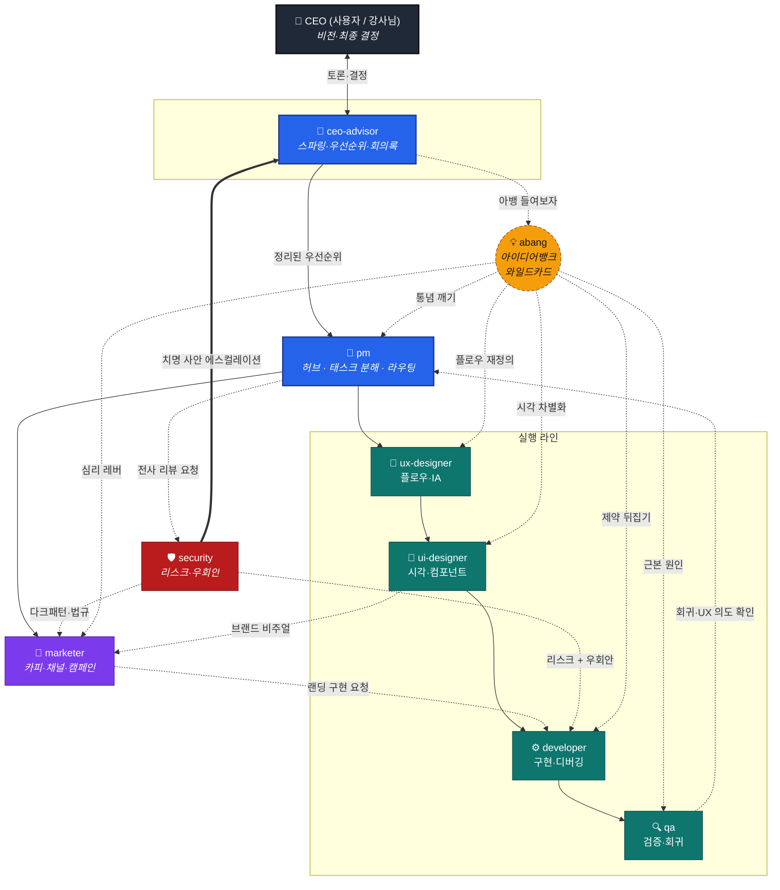
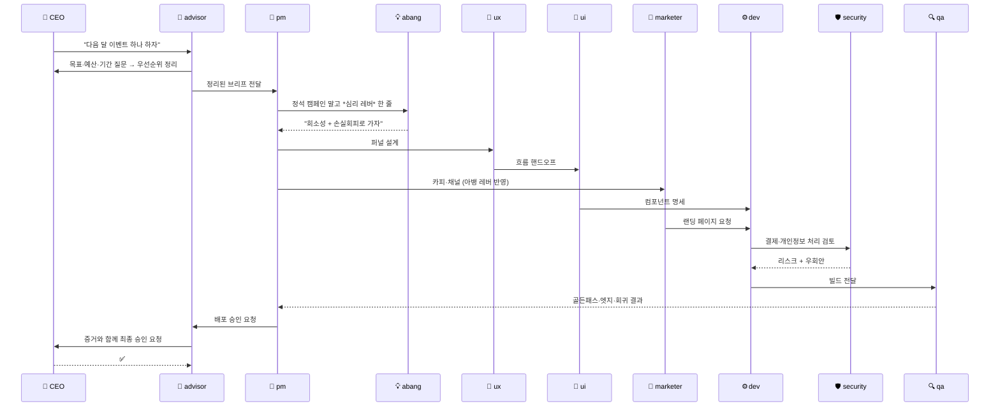

# 팀 역할 아키텍처

9개 에이전트가 어떻게 연결되어 있는지 한 장으로 본다.

- **실선** = 정상 라인(태스크/산출물이 위→아래로 흐름)
- **점선** = 와일드카드 호출 / 검토 루프 / 에스컬레이션

---

## 전체 구조



---

## 레이어별 요약

### 1. 결정 레이어 (Decision)
| 역할 | 결정권 | 핵심 산출물 |
|---|---|---|
| **CEO (사용자)** | ✅ 최종 결정 | 비전·우선순위·승인 |
| **ceo-advisor** | ❌ 토론만 | 회의록·우선순위 매트릭스·반대 의견 |

> `ceo-advisor`는 **결정하지 않는다**. 동의 봇이 되지 않도록 *반대 의견*을 던지는 게 본업.

### 2. 조율 레이어 (Coordination)
| 역할 | 입력 | 출력 |
|---|---|---|
| **pm** | advisor의 우선순위 | 태스크 분해 + 라우팅 + 의존성 |

> `pm`은 **허브**다. 직접 만들지 않고, *누가 무엇을 언제까지*만 정한다.

### 3. 실행 라인 (Execution — 순차 의존성)

```
UX → UI → Developer → QA
```

- **ux-designer**: 흐름·IA·퍼널 단계
- **ui-designer**: UX 위에 시각·컴포넌트·상태
- **developer**: UI/UX 명세를 동작하는 코드로
- **qa**: 사용자 관점에서 *부수기*. 통과해야 배포.

### 4. 확장 레이어 (Growth)
| 역할 | 위치 |
|---|---|
| **marketer** | UI(비주얼)·아뱅(심리 레버) 받아 카피·채널·캠페인. 랜딩 페이지 필요 시 developer로 다시 흐름. |

### 5. 감시 레이어 (Guard)
| 역할 | 권한 |
|---|---|
| **security** | 모든 에이전트 산출물 리뷰. 치명 사안은 ceo-advisor 경유 사용자에게 직보. *"안 됩니다"로 끝내지 않고 우회 안까지 제시.* |

### 6. 와일드카드 (Wild)
| 역할 | 호출 조건 |
|---|---|
| **abang (아뱅)** | 답이 *교과서적으로 수렴*할 때 / *경쟁사와 똑같아질 때* / *같은 버그 반복*될 때. PM 라인 밖에서 어떤 회의든 끼어들 수 있음. |

---

## 트리거 매트릭스 — "언제 누구를 부르는가"

| 상황 | 1차 호출 | 보조 호출 |
|---|---|---|
| 사용자가 우선순위 흔들릴 때 | `ceo-advisor` | — |
| 새 기능 요청 | `pm` → `ux` → `ui` → `dev` → `qa` | — |
| 카피·캠페인 필요 | `pm` → `marketer` | `abang` (심리 레버) |
| 데이터 수집·결제·로그인 추가 | `pm` → `security` → `dev` | — |
| 답이 *너무 정석*일 때 | `abang` | — |
| 테스트는 통과하는데 사용자 불만 | `qa` | `abang` (근본 원인이 심리·설계일 수 있음) |
| 법·약관·다크패턴 의심 | `security` | `ceo-advisor` (치명 시 사용자 직보) |

---

## 흐름 예시 — "이벤트 페이지 하나 만들자"



---

## 핵심 규칙 3가지

1. **결정은 위로, 산출물은 아래로.** CEO만 결정한다. PM은 분해만, advisor는 정리만.
2. **QA·Security 통과 없이는 배포 없다.** 두 감시 레이어가 같은 산출물을 다른 각도로 본다(사용자 경험 vs 리스크).
3. **아뱅은 라인 밖이다.** 점선으로 매달려 있다가 *통념대로 굳을 때*만 끼어든다 — 정상 라인을 대체하지 않는다.
